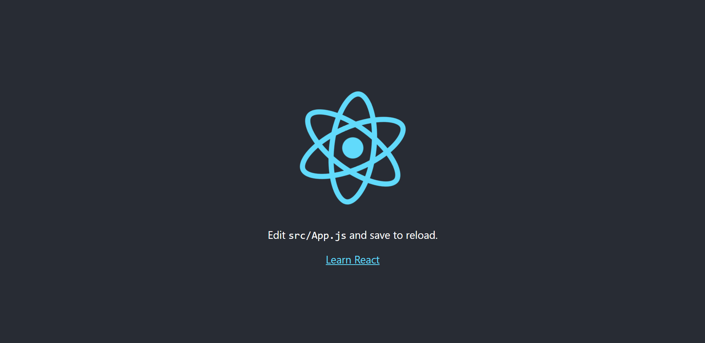
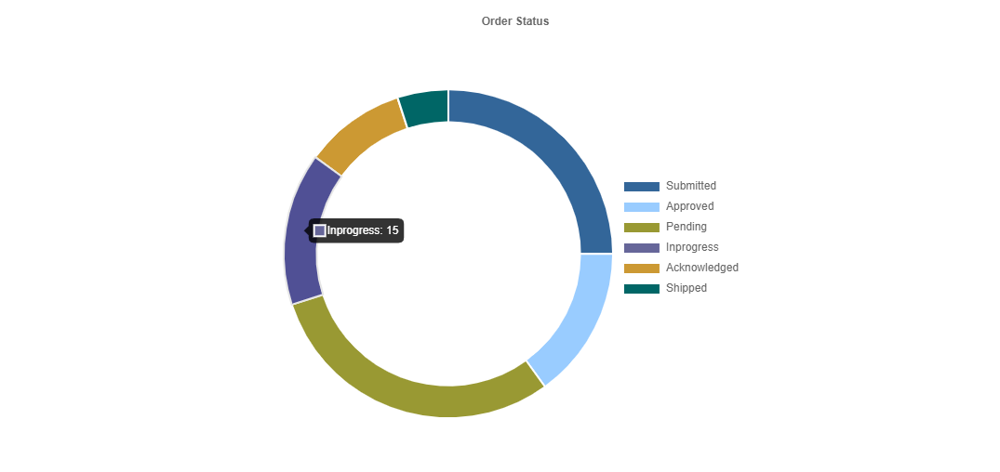
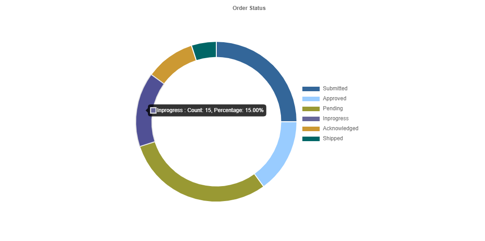

<div class="photo-details">Photo by <a href="https://unsplash.com/@firmbee?utm_source=unsplash&utm_medium=referral&utm_content=creditCopyText">Firmbee.com</a> on <a href="https://unsplash.com/s/photos/chart?utm_source=unsplash&utm_medium=referral&utm_content=creditCopyText">Unsplash</a></div>

Do you want to know how to include the [Doughnet](http://reactchartjs.github.io/react-chartjs-2/#/doughnut) Chart in a React JS application and customise the tooltip message? Let's go over the steps.

## Step 1: Create the react application

```js
npx create-react-app doughnet-custom-tooltip

```

Test the application running status

```js
cd doughnet-custom-tooltip
npm start
```

This will open your browser and the application will be running in the *http://localhost:3000*.



## Step 2: Install the required packages

In this demo application, we will use the *react-chartjs-2* Doughnet chart component. As a result, we must use the following command to install the necessary packages.

```js
npm i react-chartjs-2 chart.js
```

* *react-chartjs-2* is a React wrapper for [*Chart.js*](https://www.chartjs.org/) with a variety of appealing chart components.

* The *chart.js* library is required for the *react-chartjs-2* library to function.

## Step 3: Render the Doughnet Chart

 Modify the *App.js* page by including the *Doughnet* chart component with the necessary data and options.

### Initialize the Data and Options (settings for chart)

```js
const data = {
  labels: [
    "Submitted",
    "Approved",
    "Pending",
    "Inprogress",
    "Acknowledged",
    "Shipped"
  ],
  datasets: [
    {
      data: [25, 15, 30, 15, 10, 5],
      backgroundColor: [
        "#336699",
        "#99CCFF",
        "#999933",
        "#666699",
        "#CC9933",
        "#006666"
      ],
      borderWidth: 2
    }
  ]
};

const options = {
  cutout: "80%",
  plugins: {
    title: {
      display: true,
      text: "Order Status",
      fontSize: 10
    },
    legend: {
      display: true,
      position: "right"
    }
  }
};
```
### Rendering the Doughnet Chart

```js
<div className="App">
    <Doughnut data={data} options={options} />
</div>
```
* The *data* property stores the chart data's details such as label text and the background color of the chart bar.

* The *options* property stores information about chart settings such as legend display, position, and title display.

### Adding styles

```css
#root {
  display: flex;
  justify-content: center;
  align-items: center;
  height: 100vh;
}

.App {  
  height: 500px;
  width: 500px;
}
```
* *#root* - Styles for centering the chart on the page.

* *.App* - Styles for configuring the height and width of the chart container element to display in a specific size rather than the default size.




### Tooltip Customization

```js
  const options = {
      ...
      ...
      tooltip: {
        callbacks: {
            label: function (context) {
              let label = context.label || "";
              const data = context.dataset.data;
              const parsedValue = context.parsed;
              const total = data.reduce((a, b) => a + b, 0);
              const percentage = ((parsedValue / total) * 100).toFixed(2);
              if (percentage) {
                  label += ` : Count: ${parsedValue}, Percentage: ${percentage}%`;
              }
              return label;
            }
        }
      } 
  }
```


* [*callbacks*](https://www.chartjs.org/docs/latest/configuration/tooltip.html) - This tooltip callbacks method will be called before opening the tooltip message for each bar. As a result, the customising message returned by this method will be displayed in the tooltip.

The above code snippet can be found in the following codesandbox location as a working example.

https://codesandbox.io/s/relaxed-lederberg-vrql7