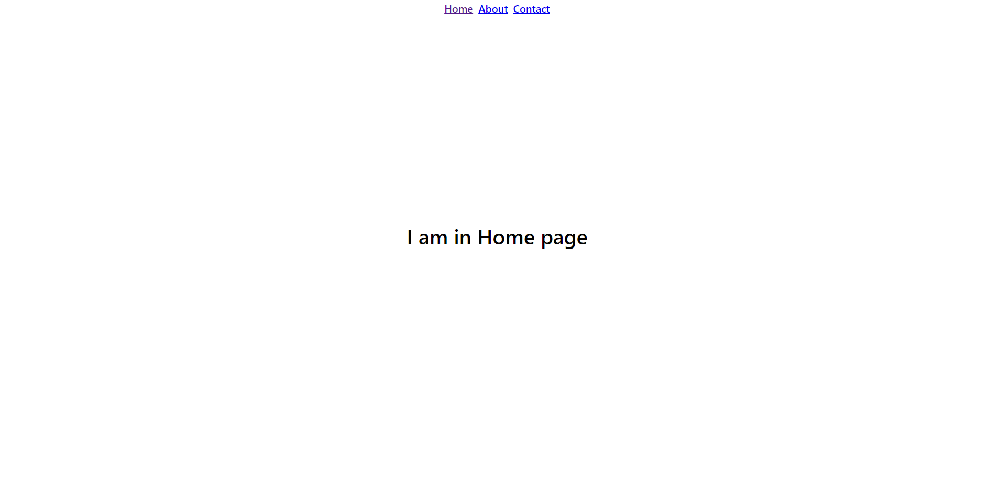
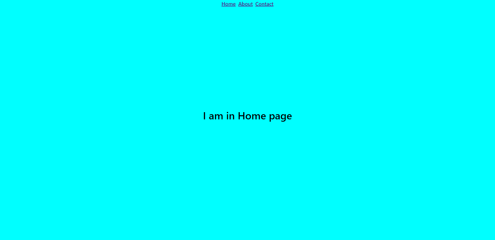
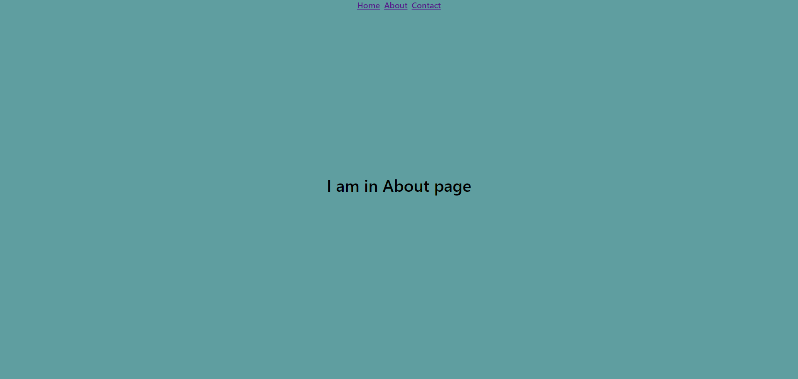
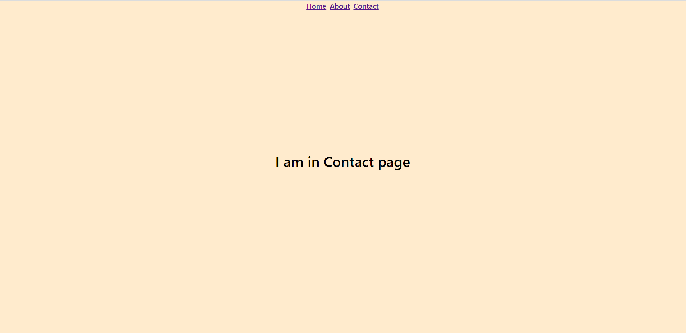

<div class="photo-details">Photo by <a href="https://unsplash.com/@theshubhamdhage?utm_source=unsplash&utm_medium=referral&utm_content=creditCopyText">Shubham Dhage</a> on <a href="https://unsplash.com/s/photos/dynamic?utm_source=unsplash&utm_medium=referral&utm_content=creditCopyText">Unsplash</a></div>  
  
While developing the application some time we may need to overwrite the particular element style based on the parent element (ex. body). For example, if we are adding one new page in the existing application and the new page styles are affected by existing page styles. We can modify the existing code, but if the application is larger means our changes may affect the existing page styles. So, in this case, we can add the class name to the body element while we navigate to our new page and overwrite the styles based on that class name.

In this article, I am going to share the information about adding the dynamic class name to the body element based on the page being active (i.e navigated) now.

I am going to create one demo application with three different pages with the name "Home, About, Contact". So, while navigating to each page adding different class names to the body element and applying the style to that page based on the class name added. The following steps help to create this application.

The first step we need to do is create the React app. I am always using the *create-react-app" to create the react application with a JavaScript template.

## Step 1: Create the react application

```js
npx create-react-app react-dynamic-classname

```

* Need to install the required package *react-router-dom* to perform the routing in our application.

```js
npm i react-router-dom
```

Test the application running status

```js
cd react-dynamic-classname
npm start
```

This will open your browser and the application will be running in the [localhost:3000](http://localhost:3000).


## Step 2: Create the menu

* Modify the *App.js* page by adding the required menu list, here adding three menu items.

```js
import { BrowserRouter as Router, Link } from "react-router-dom";
import "./styles.css";

export default function App() {
  return (
      <Router>
        <div className="menu-list">
          <Link to="/">Home</Link>
          <Link to="/About">About</Link>
          <Link to="/Contact">Contact</Link>
        </div>
    </Router>
  );
}

```
* Adding style to the menu links

```css
.menu-list {
  display: flex;
  justify-content: center;
  gap: 10px;
  font-weight: 500;
  font-size: 20px;
}
```


## Step 3: Create the pages

* Create all the three pages

**Home.js**

```js
const Home = () => {
  return <div className="page-container">I am in Home page</div>;
};

export default Home;

```

**About.js**

```js
const About = () => {
  return <div className="page-container">I am in About page</div>;
};

export default About;

```

**Contact.js**

```js
const Contact = () => {
  return <div className="page-container">I am in Contact page</div>;
};

export default Contact;

```
* Adding style to align the content

```css
.page-container {
  display: flex;
  justify-content: center;
  align-items: center;
  height: 90vh;
  font-weight: 500;
  font-size: 40px;
}
```



## Step 3: Adding the routing for the pages

```js
import "./styles.css";
import { BrowserRouter as Router, Switch, Route, Link } from "react-router-dom";
import Home from "./Home";
import About from "./About";
import Contact from "./Contact";

export default function App() {
  return (
    <Router>
      ...
      ...
      <Switch>
        <Route exact path="/">
          <Home />
        </Route>
        <Route path="/About">
          <About />
        </Route>
        <Route path="/Contact">
          <Contact />
        </Route>
      </Switch>
    </Router>
  );
}

```

## Step 4: Adding the dynamic class name

* For this we need to use the [**useEffect**](https://reactjs.org/docs/hooks-effect.html) hook and within that we can add the dynamic class to the body element.

**Home.js**

```js
import { useEffect } from "react";

const Home = () => {
  useEffect(() => {
    document.body.classList.add("home-page");
    return () => {
      document.body.classList.remove("home-page");
    };
  }, []);

  return <div className="page-container">I am in Home page</div>;
};

export default Home;

```

**About.js**

```js
import { useEffect } from "react";

const About = () => {
  useEffect(() => {
    document.body.classList.add("about-page");
    return () => {
      document.body.classList.remove("about-page");
    };
  }, []);

  return <div className="page-container">I am in About page</div>;
};

export default About;

```
**Contact.js**

```js
import { useEffect } from "react";

const Contact = () => {
  useEffect(() => {
    document.body.classList.add("contact-page");
    return () => {
      document.body.classList.remove("contact-page");
    };
  }, []);

  return <div className="page-container">I am in Contact page</div>;
};

export default Contact;

```

### Adding style

- Applying background style based on the class name applied to the body element

```css
.home-page {
  background-color: aqua;
}

.about-page {
  background-color: cadetblue;
}

.contact-page {
  background-color: blanchedalmond;
}
```






Working example available in the following codesandbox.

https://codesandbox.io/s/delicate-frost-y2iji