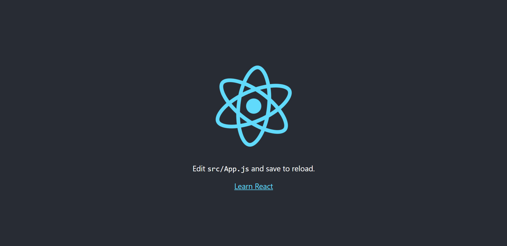

<div class="photo-details">Photo by <a href="https://unsplash.com/@mykelgran?utm_source=unsplash&utm_medium=referral&utm_content=creditCopyText">Michael Rivera 🇵🇭</a> on <a href="https://unsplash.com/?utm_source=unsplash&utm_medium=referral&utm_content=creditCopyText">Unsplash</a></div>

In this article, we are going to learn about creating the responsive Pokemon app with Material UI components in React JS using [Pokemon](https://pokeapi.co/api/v2/pokemon) public API.

This app contains the following features.

* Grid Display - To display the Pokemon basic details.
* Dialog - To display more details about the Pokemon.
* Prev/Next Buttons - To navigate between pages and display the active page Pokemon details.
* Responsive - Displaying the Pokemon details responsively.

## Step 1: Create the react application

```js
npx create-react-app react-pokemon-app

```

Test the application running status

```js
cd react-pokemon-app
npm start
```

This will open your browser and the application will be running in the *http://localhost:3000*.



## Step 2: Install the required packages

In this demo application, we are going to use the *Material UI component and icons*. So, we need to install the required packages for that as shown below.

```js
npm i @material-ui/core @material-ui/icons @material-ui/lab
```

> **Note:** @material-ui/core, @material-ui/lab package contains the [components](https://v4.mui.com/) and @material-ui/icons package contains the [icons](https://v4.mui.com/components/material-icons/#material-icons).

Also, we need to install the [**axios**](https://axios-http.com/) library by using the following command. Since, we are going to use this axios (post method) to trigger the API request.

```js
npm i axios
```

## Step 3: Create the required components and styles

* Modify the *App.js* page by adding the required component *Button* for navigating different pages, *Paper* for basic detail display and "Dialog* for more details display.

###  Initialize the required state variables

```js
    const App = () => {
      const classes = useStyles();
      const [showDialog, setShowDialog] = useState(false); // To handle dialog display (for Pokemon depth details)
      const [tabIndex, setTabIndex] = useState(0);
      const [selectedPokemon, setSelectedPokemon] = useState({}); // To maintain the selected/active Pokemon data
      const [pokemonData, setPokemonData] = useState([]); // To maintain the active page Pokemon data
      const [requestUrl, setRequestUrl] = useState({
          url: {
              prev: null,
              next: null,
              initial: 'https://pokeapi.co/api/v2/pokemon' // Initial Pokemon Api
          }
      });
      ...
      ...
    }
```

* *showDialog* - Decides to show/hide the dialog.

* *tabIndex* - Maintains the active tab index value of the Tab component.

* *selectedPokemon* - Maintains the selected Pokemon details while displaying its details in dialog.

* *pokemonData* - Maintains the active page Pokemon data.

* *requestUrl* - Maintains the active page request url as well as previous and next page request url.

> **Note:** Each page, we are triggering the API request and show the Pokemon details based on that corresponding page response.

### Getting the Pokemon Data

```js
    ...
    ...
    // Pokemon request and response processing
    const loadPokemonData = async (operation) => {
        const { url } = requestUrl;
        const pokemonUrl = operation === "initial" ? url.initial : operation === "next" ? url.next : url.prev;
        const response = await axios.get(pokemonUrl);
        url.next = response.data.next;
        url.prev = response.data.previous;
        setRequestUrl({ url });
        const result = await response.data.results;
        const urls = result.map(res => axios.get(res.url));
        const pokemonData = await (await axios.all(urls)).map(uRes => uRes.data);
        setPokemonData(pokemonData);
    }

    useEffect(() => {        
        loadPokemonData("initial");
        // eslint-disable-next-line
    }, []);
    ...
    ...
```

* Here, we are calling the API method through *axios* post request and store the response in the state(pokemonData) variable.

* This *loadPokemonData* method will be called on each page navigation and gets the latest response.

### Processing Pokemon Name and Id

```js
    // Converting the Pokemon name first letter uppercase
    const getPokeName = name => name.slice(0, 1).toUpperCase() + name.slice(1, name.length);

    // Forming the Pokemon id to display
    const getPokeId = id => {
        if (id < 10) return `#00${id}`;
        if (id < 100 && id >= 10) return `#0${id}`;
        if (id >= 100) return `#${id}`;
    }
```

* *getPokeName* method get the Pokemon name and converts its first letter in upper case and returns the converted name.

* *getPokeId* method receives the id and formats the unique id based on its value range and returns the formatted value.

### Card Background Color

```js
// Processing the background color based on the Pokemon type
    const getBackColor = (poke, type) => {
        let backColor = type === "img" ? "#fffcdb" : "#EEE8AA";
        const pokeTypes = poke.types.map(i => i.type.name);
        if (pokeTypes.includes("fire")) {
            backColor = type === "img" ? "#fff1ee" : "#FEC5BB";
        } else if (pokeTypes.includes("grass")) {
            backColor = type === "img" ? "#ccfcef" : "#80FFDB";
        } else if (pokeTypes.includes("water")) {
            backColor = type === "img" ? "#f2f5ff" : "#DFE7FD";
        } else if (pokeTypes.includes("bug")) {
            backColor = type === "img" ? "#d6f5ce" : "#B0DEA3"
        } else if (pokeTypes.includes("normal")) {
            backColor = type === "img" ? "#8efafa" : "#E0FFFF"
        } else if (pokeTypes.includes("electric")) {
            backColor = type === "img" ? "#ebfcf2" : "#D8E2DC"
        } else if (pokeTypes.includes("ground")) {
            backColor = type === "img" ? "#ffebf2" : "#FAD2E1";
        } else if (pokeTypes.includes("fairy")) {
            backColor = type === "img" ? "#fcf7f2" : "#FFF1E6";
        } else if (pokeTypes.includes("ghost")) {
            backColor = type === "img" ? "#ffcbc2" : "#F8EDEB";
        } else if (pokeTypes.includes("fighting")) {
            backColor = type === "img" ? "#c2fcae" : "#F1FAEE";
        } else if (pokeTypes.includes("rock")) {
            backColor = type === "img" ? "#c9fdff" : "#A8DADC";
        }
        return backColor;
    }
```

* *getBackColor* method receives the Pokemon information and returns the specific background color based on its type.

### TabPanel Component

```js
// Tab Panel component to display the tab content
    const TabPanel = props => {
        const { children, value, index, ...other } = props;

        return (
            <div
                role="tabpanel"
                hidden={value !== index}
                id={`simple-tabpanel-${index}`}
                aria-labelledby={`simple-tab-${index}`}
                {...other}
            >
                {value === index && (
                    <Box p={3}>
                        {children}
                    </Box>
                )}
            </div>
        );
    }
```

* This TabPanel component will be displayed within the dialog.

* There are two tabs displaying in the dialog and first tab will show the details of the Pokemon stat details and the second tab will be displaying its types.

### Title and Navigation Button components

```js
<Box className={`${classes.centerAlign} ${classes.flexColumn}`}>
            {/* Pokemon Title */}
            <Typography variant='h4'>Pokemon App</Typography>
            {/* Navigation Buttons */}
            <ButtonGroup className={classes.btnGroup} variant='contained' size='medium' color='secondary'>
                <Button variant='contained' disabled={url.prev === null}
                    size="medium" color="secondary"
                    startIcon={<PrevIcon />}
                    onClick={() => loadPokemonData("prev")}>Prev</Button>
                <Button variant='contained' disabled={url.next === null}
                    size="medium" color="secondary"
                    startIcon={<NextIcon />}
                    onClick={() => loadPokemonData("next")}>Next</Button>
            </ButtonGroup>
        </Box>
```

* Here rendering one *Typography* component to display the application title (i.e. Pokemon App).

* Also, rendering one *ButtonGroup* component with two buttons for navigating between pages.

### Pokemon List Display

```js
{/* Pokemon List Display */}
        <Box>
            <Grid container spacing={1}>
                {pokemonData ? pokemonData.map(poke => {
                    const types = poke.types.map(item => item.type.name);
                    return (
                        <Grid key={poke.id} item xs={12} sm={6} md={4} lg={3}>
                            <Paper className={`${classes.paper} ${classes.centerAlign}`} style={{ backgroundColor: getBackColor(poke, 'paper') }}>
                                <Box className={`${classes.flexColumn} ${classes.centerAlign}`}>
                                    <Tooltip title="More Info">
                                        <Button className={classes.btn} variant='outlined'
                                            size='small'
                                            onClick={() => {
                                                setShowDialog(!showDialog);
                                                setSelectedPokemon(poke);
                                            }}>
                                            {getPokeId(poke.id)}
                                        </Button>
                                    </Tooltip>
                                    <Typography variant='h5'>{getPokeName(poke.name)}</Typography>
                                    <Box>
                                        <Typography>{`Type: ${types.toString()}`}</Typography>
                                    </Box>
                                </Box>
                                <Box>
                                    {poke.sprites.other.dream_world.front_default ? (
                                        </img>
                                        ) : (
                                        <Skeleton variant="rect" width={75} height={75} />
                                    )}
                                </Box>
                            </Paper>
                        </Grid>
                    )
                }) : "Loading"}
            </Grid>
        </Box>
```

* *Grid* component to create the responsive layout.

* *Paper* component to render the card container and its content.

* *Box* component acting as the container for its children.

* *Tooltip* component to display the small tooltip while hovering the button with "More Info" text.

* *Button* component is used to show or hide the dialog display.

* *Typography* component is used to display the Pokemon name and used to display its type.

* *img* is used to display the Pokemon image.


### Pokemon Detail display Dialog component

```js
{/* Pokemon Details Display */}
        {showDialog &&
            <Dialog open={showDialog}
                onClose={() => {
                    setShowDialog(!showDialog);
                    setSelectedPokemon({});
                }}>
                <Card className={classes.root}>
                    <CardActionArea disableRipple style={{ backgroundColor: getBackColor(selectedPokemon, 'paper') }}>
                        <CardContent className={`${classes.centerAlign} ${classes.cardContent}`}>
                            <Box style={{ padding: '1rem 0 1rem 0' }}>
                                <Paper className={`${classes.centerAlign} ${classes.cardImage}`} style={{ backgroundColor: getBackColor(selectedPokemon, 'img') }}>
                                    </img>
                                </Paper>
                            </Box>
                            <Box className={`${classes.centerAlign} ${classes.flexColumn} ${classes.cardContentBox}`}>
                                <Chip size='medium' color='primary' label={getPokeName(selectedPokemon.name)} style={{ color: 'black', backgroundColor: getBackColor(selectedPokemon, 'paper') }} />
                                <Box className={`${classes.centerAlign} ${classes.flexColumn} ${classes.flexRow}`}>
                                    <Typography className={`${classes.centerAlign} ${classes.flexColumn}`}>
                                        Height: {selectedPokemon.height} m
                                                        </Typography>
                                    <Typography className={`${classes.centerAlign} ${classes.flexColumn}`}>
                                        Weight: {selectedPokemon.weight} kg
                                                        </Typography>
                                </Box>
                                <Paper className={classes.tabRoot} style={{ border: `1px solid ${getBackColor(selectedPokemon)}` }}>
                                    <Tabs
                                        value={tabIndex}
                                        onChange={(event, item) => {
                                            setTabIndex(item)
                                        }}
                                        TabIndicatorProps={{
                                            style: { backgroundColor: getBackColor(selectedPokemon) }
                                        }}
                                        textColor="primary"
                                    >
                                        <Tab label="Stats" disableRipple />
                                        <Tab label="Abilities" disableRipple />
                                    </Tabs>
                                    <TabPanel value={tabIndex} index={0}>
                                        <span>HP</span> <LinearProgress variant="determinate" value={normalise(selectedPokemon.stats[0].base_stat)} />
                                        <span>ATK</span> <LinearProgress variant="determinate" value={normalise(selectedPokemon.stats[1].base_stat)} />
                                        <span>DEF</span> <LinearProgress variant="determinate" value={normalise(selectedPokemon.stats[2].base_stat)} />
                                        <span>SATK</span> <LinearProgress variant="determinate" value={normalise(selectedPokemon.stats[3].base_stat)} />
                                        <span>SDEF</span> <LinearProgress variant="determinate" value={normalise(selectedPokemon.stats[4].base_stat)} />
                                        <span>SPD</span> <LinearProgress variant="determinate" value={normalise(selectedPokemon.stats[5].base_stat)} />
                                    </TabPanel>
                                    <TabPanel value={tabIndex} index={1}>
                                        {selectedPokemon.abilities.map(item => {
                                            return (
                                                <Chip className={classes.chipRoot} key={item.ability.name} variant='outlined' size='small' label={item.ability.name} />
                                            )
                                        })}
                                    </TabPanel>
                                </Paper>
                            </Box>
                        </CardContent>
                    </CardActionArea>
                </Card>
            </Dialog>
        }
```

* *Dialog* component is used display the modal popup.

* *Card* component is used to display the Pokemon details with images.

* *Tab* component is used to display two different tabs in the modal popup. Tab contains the details of the Pokemon ability and its stats.

* *Typography* component is used to display the height and weight of the Pokemon.

* *Chip* component is used to display the name of the Pokemon and its ability.

* *LinearProgress* component is used to display the details of the Pokemon stats.

### Customized styles

```js
/* Customizing styles */
const useStyles = makeStyles((theme) => ({
    centerAlign: {
        display: "flex",
        justifyContent: "center",
        alignItems: "center"
    },
    paper: {
        padding: theme.spacing(2),
        textAlign: "center",
        color: theme.palette.text.primary,
        gap: "1em"
    },
    flexColumn: {
        gap: "1em",
        flexDirection: "column"
    },
    flexRow: {
        flexDirection: "row",
        gap: '4rem',
        padding: '1rem'
    },
    btn: {
        borderRadius: "1rem",
        borderColor: "black",
        color: "black"
    },
    btnGroup: {
        margin: "1rem"
    },
    cardContent: {
        flexDirection: "column",
        borderRadius: "2rem",
        padding: 0
    },
    cardContentBox: {
        padding: "1rem",
        borderRadius: "1rem 1rem 0 0",
        backgroundColor: "#FFFFFF"
    },
    cardImage: {
        height: "10rem",
        width: "10rem",
        borderRadius: "50%"
    },
    tabRoot: {
        width: "100%"
    },
    chipRoot: {
        margin: '0 .25rem'
    }
}));
```
* Here we are adding the above styles to position and making the Pokemon list display and its details display.

A working example of the above code snippet can be found in the following codesandbox location.

https://codesandbox.io/s/fervent-pine-p1zbr