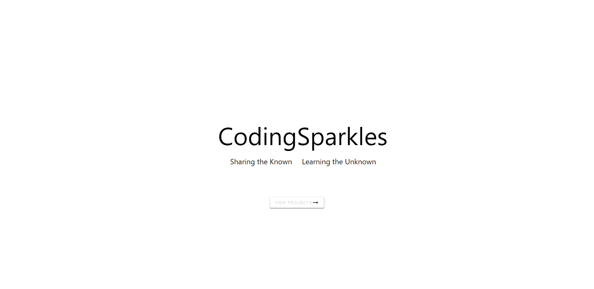
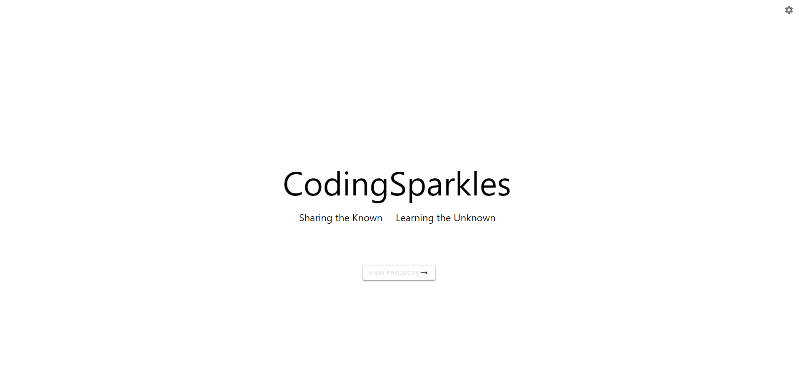
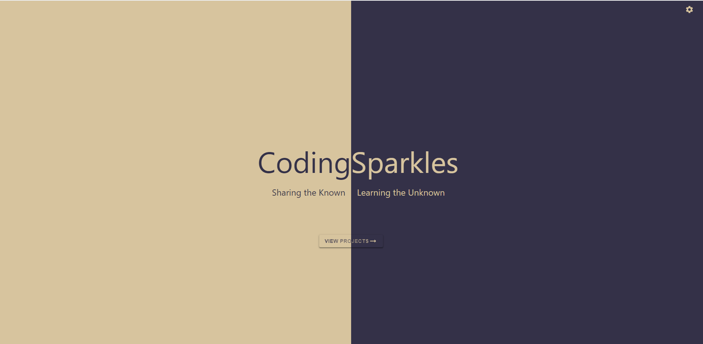
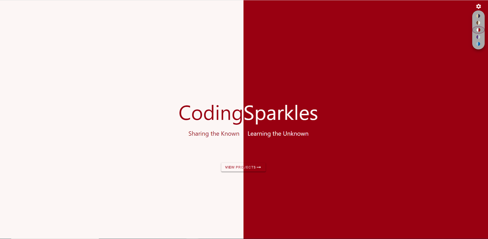
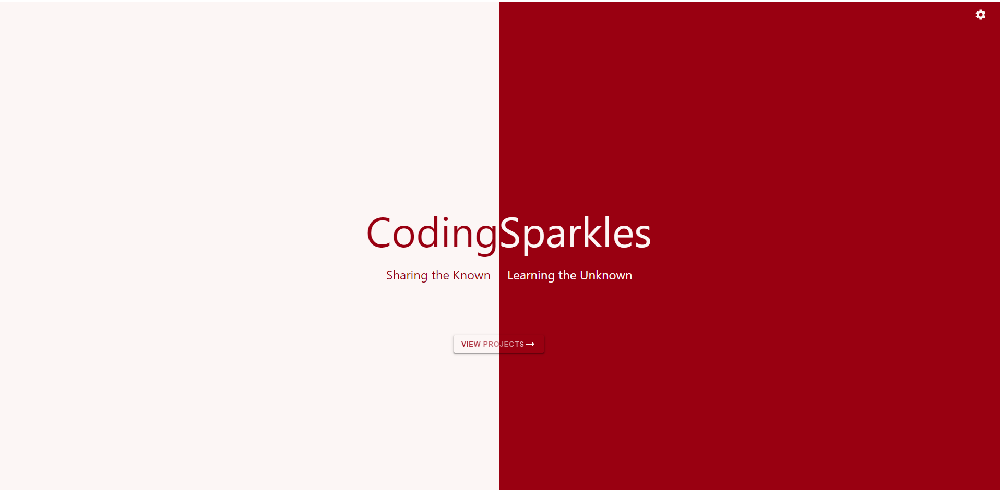

<div class="photo-details">Photo by <a href="https://unsplash.com/@pawel_czerwinski?utm_source=unsplash&utm_medium=referral&utm_content=creditCopyText">Pawel Czerwinski</a> on <a href="https://unsplash.com/?utm_source=unsplash&utm_medium=referral&utm_content=creditCopyText">Unsplash</a></div>
  
In this article, we are going to learn about the steps to create the theme switcher based on the class name in react js application.

In this example, we are using five themes and all the themes will be in two colors (first half one color, the second half in another color vertically).

The first step we need to do is create the React app. I am always using the *create-react-app" to create the react application with a JavaScript template.

## Step 1: Create the react application

```js
npx create-react-app react-theme-demo

```

Test the application running status

```js
cd react-theme-demo
npm start
```

This will open your browser and the application will be running in the [http://localhost:3000](*http://localhost:3000*).


## Step 2: Install the required packages

In this demo application, we are going to use the *Material UI component and icons*. So, we need to install the required packages for that as shown below.

```js
npm i @material-ui/core @material-ui/icons
```

> **Note:** @material-ui/core package contains the [components](https://v4.mui.com/) and @material-ui/icons package contains the [icons](https://v4.mui.com/components/material-icons/#material-icons).


Also, we are using the "scss" file for storing CSS style. So, need to install the *node-sass* package to overcome style conversion errors.

```js
npm i node-sass
```

## Step 3: Adding the elements (to display content in the center) in the page

* Modify the *App.js* page by adding the required div element for the content display and one button without any actions for the showcase.

```js
import { useState } from "react";
import { Button } from "@material-ui/core";
import ArrowRightAltSharp from "@material-ui/icons/ArrowRightAltSharp";
import "./App.scss";

const App = () => {
  return (
    <>
      <div className={`home-page`}>
        <div className="hp-first-half">
          <div className="main-title">Coding</div>
          <div className="sub-title">Sharing the Known</div>
        </div>
        <div className="hp-second-half">
          <div className="main-title">Sparkles</div>
          <div className="sub-title">Learning the Unknown</div>
        </div>
        <Button
          className="hp-btn"
          variant="contained"
          size="medium"
          disableRipple
        >
          View Projects <ArrowRightAltSharp className="hp-btn-icon" />
        </Button>
      </div>
    </>
  );
};

export default App;

```
> **Note:** Here added the material UI [Button](https://v4.mui.com/components/buttons/) component and right arrow icon to display the button with icon

* Add the following code to style the elements.

```scss
$titleFontSize: 5rem;
$subTitleFontSize: 1.5rem;

.home-page {
    height: 100vh;
    display: flex;

    .hp-first-half,
    .hp-second-half {
        height: 100%;
        width: 50%;
        display: flex;
        align-items: center;
        justify-content: center;
        flex-direction: column;

        .main-title {
            font-size: $titleFontSize;
        }

        .sub-title {
            font-size: $subTitleFontSize;
            padding: 1rem;
        }
    }

    .hp-first-half {

        .main-title,
        .sub-title {
            align-self: flex-end;
        }
    }

    .hp-second-half {

        .main-title,
        .sub-title {
            align-self: flex-start;
        }
    }

    .hp-btn {
        -webkit-text-fill-color: transparent;
        -webkit-background-clip: text;
        position: absolute;
        top: 70%;
        left: 50%;
        transform: translate(-50%, -50%);
        font-weight: bold;
    }
}
```


## Step 4: Create the theme switcher

To create the theme switcher using the material UI *IconButton* and *Menu* components. 

* [IconButton](https://v4.mui.com/components/buttons/) to display the settings icon and to open the menu popup while clicking it

* [Menu](https://v4.mui.com/components/menus/) to display all the theme options and select one option from them

### Render the elements

```js
    import { Button, IconButton, Menu, MenuItem } from "@material-ui/core";
    import SettingsIcon from "@material-ui/icons/Settings";
    ...
    ...
    const themeNames = [
        "theme-soybean-eclipse",
        "theme-sweetcorn-toffee",
        "theme-spacecherry-white",
        "theme-royalpurple-iceflow",
        "theme-electricBlueLemonade-aquamarine"
    ];
    ...
    ...
    <div className='hp-theme-switcher'>
                <IconButton
                    aria-label="more"
                    aria-controls="long-menu"
                    aria-haspopup="true"
                    className='hp-theme-icon'
                >
                    <SettingsIcon />
                </IconButton>
                <Menu className='theme-menu'>
                    {
                        themeNames.map((theme, index) => <MenuItem>
                            <div className={`theme ${theme}`}>
                            </div>
                        </MenuItem>)
                    }
                </Menu>
    </div>
    ...
    ...
```

Add the styles for this.

* To position the settings icon in the top right corner

```scss
    ...
    ...
    .hp-theme-switcher {
        position: absolute;
        right: 13px;
    }
    ...
    ...
```

* Color codes for the Five themes

```scss
$soybean : #D7C49EFF;
$eclipse: #343148FF;
$sweetcorn: #F2EDD7FF;
$toffee: #755139FF;
$spacecherry:#990011FF;
$white:#FCF6F5FF;
$royalpurple:#603F83FF;
$iceflow: #C7D3D4FF;
$electricBlueLemonade:#0063B2FF;
$aquamarine: #9CC3D5FF;
```

* To style the menu popover and its item

```scss

.MuiPopover-root.theme-menu .MuiPaper-root {
    background: darkgray;
    border-radius: 50px;
    top: 40px !important;
    right: 13px;
    left: auto !important;

    .MuiList-root .MuiListItem-root {
        &.Mui-selected {
            border-radius: 50%;
            border: 1px solid #85144b;
        }

        .theme {
            border-radius: 50%;
            border-radius: 50%;
            border-width: 7.5px;
            border-style: solid;
            height: 0px;
            width: 0px;
            -webkit-transform: rotate(45deg);
            -moz-transform: rotate(45deg);
            -o-transform: rotate(45deg);
            -ms-transform: rotate(45deg);
            transform: rotate(45deg);

            // To apply the border color for the selected item

            &.theme-soybean-eclipse {
                border-color: $eclipse $eclipse $soybean $soybean;
            }

            &.theme-sweetcorn-toffee {
                border-color: $sweetcorn $sweetcorn $toffee $toffee;
            }

            &.theme-spacecherry-white {
                border-color: $spacecherry $spacecherry $white $white;
            }

            &.theme-royalpurple-iceflow {
                border-color: $iceflow $iceflow $royalpurple $royalpurple;
            }

            &.theme-electricBlueLemonade-aquamarine {
                border-color: $electricBlueLemonade $electricBlueLemonade $aquamarine $aquamarine;
            }
        }
    }
}

```


### Add the actions

* Add the click event to the icon button (settings) to show the menu popup whenever click the icon.

* Add the click event to the menu item to update the selected theme details.

```js
    const [themeName, setThemeName] = useState("theme-soybean-eclipse"); // To maintain the active theme and change the thme when new theme selected
    const [targetEl, setTargetEl] = useState(null); // To maintain the target element to show the menu popup
    const [selectedIndex, setSelectedIndex] = useState(0); // To maintain the seleted theme index

    // To change the them when selected from the menu item
    const handleClick = event => {
        setTargetEl(event.currentTarget);
    }

    // To change the theme, selected theme index and close the popup menu (setting target as null) when selected new theme
    const handleThemeClick = (theme, index) => {
        setThemeName(`${theme}`);
        setSelectedIndex(index);
        setTargetEl(null);
    }

    return (
    <>
      <div className={`home-page ${themeName}`}>
        ...
        ...
        <IconButton
            aria-label="more"
            aria-controls="long-menu"
            aria-haspopup="true"
            className='hp-theme-icon'
            onClick={handleClick}
            disableRipple>

            <SettingsIcon />
        </IconButton>
        <Menu className='theme-menu' anchorEl={targetEl}
            keepMounted
            open={Boolean(targetEl)}
            onClose={() => setTargetEl(null)}>
            {
                themeNames.map((theme, index) => 
                <MenuItem selected={index === selectedIndex}
                    onClick={() =>handleThemeClick(theme, index)}>
                        <div className={`theme ${theme}`}>
                        </div>
                    </MenuItem>)
            }
        </Menu>
    ...
    ...
```

* Adding the style to apply the selected theme to the page

```scss
.home-page {
    height: 100vh;
    display: flex;

    ...
    ...

    // To apply the styles to the component based on the selected theme
    
    &.theme-soybean-eclipse {
        .hp-first-half {
            background: $soybean;
            color: $eclipse;
        }

        .hp-second-half {
            background: $eclipse;
            color: $soybean;
        }

        .hp-btn {
            background-image: linear-gradient(to right, $eclipse, $soybean);

            .hp-btn-icon {
                fill: $soybean;
            }
        }

        .hp-theme-switcher .hp-theme-icon svg {
            fill: $soybean;
        }
    }

    &.theme-sweetcorn-toffee {

        .hp-first-half {
            background: $toffee;
            color: $sweetcorn;
        }

        .hp-second-half {
            background: $sweetcorn;
            color: $toffee;
        }

        .hp-btn {
            background-image: linear-gradient(to right, $sweetcorn, $toffee);

            .hp-btn-icon {
                fill: $toffee;
            }
        }

        .hp-theme-switcher .hp-theme-icon svg {
            fill: $toffee;
        }
    }

    &.theme-spacecherry-white {

        .hp-first-half {
            background: $white;
            color: $spacecherry;
        }

        .hp-second-half {
            background: $spacecherry;
            color: $white;
        }

        .hp-btn {
            background-image: linear-gradient(to right, $spacecherry, $white);

            .hp-btn-icon {
                fill: $white;
            }
        }

        .hp-theme-switcher .hp-theme-icon svg {
            fill: $white;
        }
    }

    &.theme-royalpurple-iceflow {

        .hp-first-half {
            background: $royalpurple;
            color: $iceflow;
        }

        .hp-second-half {
            background: $iceflow;
            color: $royalpurple;
        }

        .hp-btn {
            background-image: linear-gradient(to right, $iceflow, $royalpurple);

            .hp-btn-icon {
                fill: $royalpurple;
            }
        }

        .hp-theme-switcher .hp-theme-icon svg {
            fill: $royalpurple;
        }
    }

    &.theme-electricBlueLemonade-aquamarine {

        .hp-first-half {
            background: $aquamarine;
            color: $electricBlueLemonade;
        }

        .hp-second-half {
            background: $electricBlueLemonade;
            color: $aquamarine;
        }

        .hp-btn {
            background-image: linear-gradient(to right, $electricBlueLemonade, $aquamarine);

            .hp-btn-icon {
                fill: $aquamarine;
            }
        }

        .hp-theme-switcher .hp-theme-icon svg {
            fill: $aquamarine;
        }
    }
}
```






Sample work used with the above code snippets can be found in the following codesandbox.

https://codesandbox.io/s/muddy-field-uc4vi?file=/src/App.js 